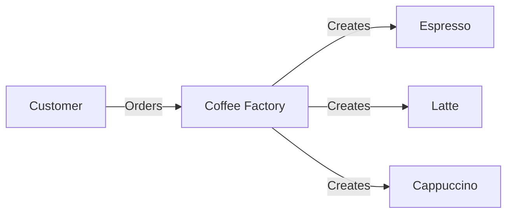

# Abstract Factory Pattern

> Keywords: factory of factories, object creation, interchangeable products

## Introduction

Imagine a coffee shop that serves different types of coffee. Each coffee type requires specific ingredients and preparation methods. Instead of manually handling each coffee type, we can use a Coffee Factory to create the right coffee for us.

This is the Abstract Factory Pattern, which provides an interface for creating families of related or dependent objects without specifying their concrete classes.

## Problem Statement

Suppose you and I walk into a coffee shop and order different types of coffee—Espresso, Latte, and Cappuccino. If the barista had to manually handle each coffee’s ingredients and preparation, mistakes could happen, and the process would be inefficient.

Similarly, in programming, when dealing with multiple related objects, creating them manually can lead to tight coupling and reduced maintainability.

## Solution

The Abstract Factory Pattern provides a way to encapsulate a group of related object factories under a common interface. This allows:

- Creating multiple related objects without specifying their exact classes.

- Improving code organization and maintainability.

- Easily swapping out different object families (e.g., switching coffee types).

### Benefits

Helps create families of related objects without modifying existing code.

Promotes consistency when working with multiple object types.

Makes code more flexible and scalable.

## Implementation

### Diagram



### Code Implementation

```python
from abc import ABC, abstractmethod

# Abstract Coffee class
class Coffee(ABC):
    @abstractmethod
    def prepare(self):
        pass

# Concrete Coffee types
class Espresso(Coffee):
    def prepare(self):
        return "Espresso: Strong and black coffee."

class Latte(Coffee):
    def prepare(self):
        return "Latte: Smooth coffee with steamed milk."

class Cappuccino(Coffee):
    def prepare(self):
        return "Cappuccino: Espresso with frothed milk."

# Abstract Factory
class CoffeeFactory(ABC):
    @abstractmethod
    def create_coffee(self):
        pass

# Concrete Factories
class EspressoFactory(CoffeeFactory):
    def create_coffee(self):
        return Espresso()

class LatteFactory(CoffeeFactory):
    def create_coffee(self):
        return Latte()

class CappuccinoFactory(CoffeeFactory):
    def create_coffee(self):
        return Cappuccino()

# Client Code
if __name__ == "__main__":
    factories = {
        "espresso": EspressoFactory(),
        "latte": LatteFactory(),
        "cappuccino": CappuccinoFactory()
    }
    
    choice = "latte"  # Simulating customer order
    coffee = factories[choice].create_coffee()
    print(coffee.prepare())
```
## Conclusion

Just like how a coffee shop has different coffee types prepared through a structured process, the Abstract Factory Pattern provides a way to create related objects systematically. It helps in organizing code efficiently and makes it easier to switch between different object families.

