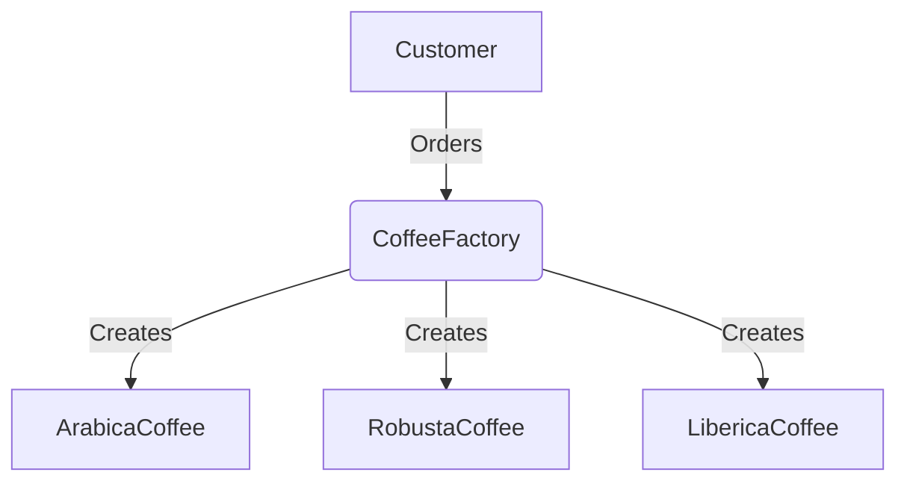

# Factory Pattern

> Keywords: object creation, encapsulation, flexibility

## Introduction

In a coffee shop, different types of coffee beans are used to make various drinks. But as customers, we don’t worry about how the beans are selected—we just order our coffee, and the shop provides the right beans for the drink.

This is exactly how the Factory Pattern works! Instead of manually creating objects, we delegate the task to a factory that decides which object to return based on our needs.

## Problem Statement

Imagine you and I walk into a coffee shop and ask for different types of coffee. If the shop didn’t have an organized system, the barista would have to manually pick beans each time, leading to inconsistency and inefficiency.

Similarly, in programming, when creating multiple objects of different types, hardcoding them can lead to:

- Repetitive and messy code.

- A lack of flexibility when adding new coffee types (or object types).

- A difficult-to-maintain system.

## Solution

The Factory Pattern allows us to create objects without specifying the exact class. Instead, we delegate the object creation process to a factory class.

### Benefits

- Simplifies object creation.

- Encourages encapsulation and modularity.

- Makes adding new coffee variants easier.

## Implementation

### Diagram



### Theoretical Explanation

The Factory class takes an order (a request for coffee) and decides which coffee bean type to create.

Instead of creating objects manually, we rely on the factory to handle this decision.

This makes the code flexible and scalable, as adding new coffee types doesn’t require modifying existing logic.

## Code Implementation

```python
class Coffee:
    def brew(self):
        pass

class ArabicaCoffee(Coffee):
    def brew(self):
        return "Brewing a cup of Arabica coffee!"

class RobustaCoffee(Coffee):
    def brew(self):
        return "Brewing a cup of Robusta coffee!"

class LibericaCoffee(Coffee):
    def brew(self):
        return "Brewing a cup of Liberica coffee!"

class CoffeeFactory:
    @staticmethod
    def get_coffee(bean_type):
        coffee_types = {
            "arabica": ArabicaCoffee(),
            "robusta": RobustaCoffee(),
            "liberica": LibericaCoffee()
        }
        return coffee_types.get(bean_type.lower(), None)

if __name__ == "__main__":
    coffee_type = "arabica"
    coffee = CoffeeFactory.get_coffee(coffee_type)
    if coffee:
        print(coffee.brew())
    else:
        print("Sorry, we don't have that coffee type.")
```

## Conclusion

The Factory Pattern simplifies object creation by delegating it to a specialized class. Just like how a coffee shop selects the right coffee beans based on our order, a factory class decides which object to instantiate. This makes the system more maintainable and flexible!

