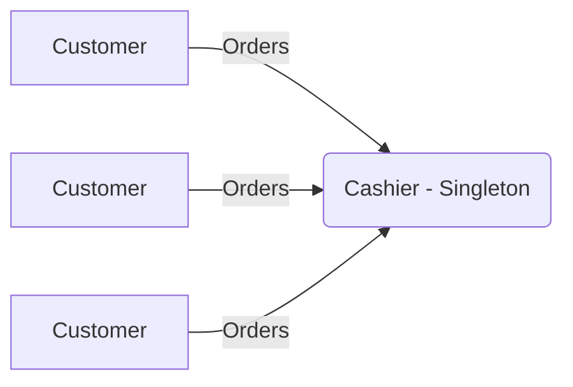

# Singleton 

> Keywords: share resources, single instance, global access

## Introduction

In a coffee shop, there is only **one** cashier. Why?
- If there were multiple cashiers, they would need extra space, which might not be efficient.
- Having a single cashier helps maintain consistency in processing orders and payments.
- It ensures that resources like the cash register are used optimally.

This setup mirrors the **Singleton** pattern in software design, where a single instance of a class is used to manage shared resources.

## Problem Statement

Imagine you and I walk into a coffee shop, and every time we order, we have to deal with a different cashier. That would be confusing, right?
- We might get inconsistent service.
- Payments could be processed differently each time.
- The shop would need extra resources to manage multiple cashiers.

Similarly, in programming, if multiple instances of a class manage the same resource, it can lead to unexpected behaviors and inefficiencies.

## Solution

The **Singleton** pattern ensures that a class has only **one** instance and provides a **global access point** to it. Just like how you and I interact with a single cashier in a coffee shop, this pattern ensures that every part of our program interacts with the same instance of a class.

### Benefits
- Saves resources by avoiding multiple instances.
- Ensures consistency in managing a shared resource.
- Provides a controlled way to access that resource.

## Implementation

### Diagram



### Theoretical Explanation
- The **Singleton** class restricts instantiation so that only **one** object exists.
- It provides a **static method** to get that single instance.
- This ensures that any part of the program interacting with it is using the **same instance**.

### Code Implementation

```python
class CashierMeta:
    _name: str

    def __new__(cls, name):
        if not hasattr(cls, "instance"):
            cls.instance = super(CashierMeta, cls).__new__(cls)
            cls.instance._name = name

        return cls.instance


class Cashier(CashierMeta):
    def __repr__(self):
        return f"Cashier name is {self._name}"


if __name__ == "__main__":
    cashier_name = "Minh Le Duc 00"
    cashier_00 = Cashier(cashier_name)
    print(cashier_00)  # Cashier name is Minh Le Duc 00

    # Create another instance
    cashier_01 = Cashier(cashier_name)
    if cashier_00 == cashier_01:
        print("Both cashiers share the same instance!!!")
```

## Conclusion

Just like a coffee shop benefits from having a single cashier to manage all transactions efficiently, the **Singleton** pattern ensures that a single instance is used to manage shared resources in a program. This helps in saving memory, ensuring consistency, and improving maintainability.

